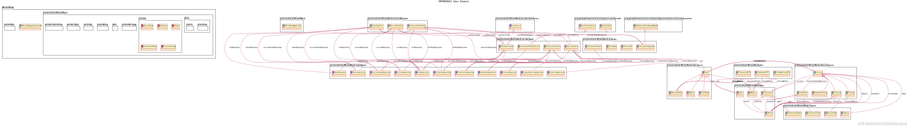
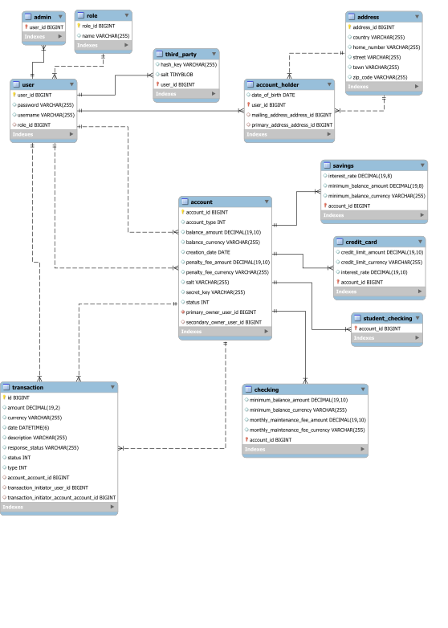

<!-- PROJECT SHIELDS -->
<!--
*** I'm using markdown "reference style" links for readability.
*** Reference links are enclosed in brackets [ ] instead of parentheses ( ).
*** See the bottom of this document for the declaration of the reference variables
*** for contributors-url, forks-url, etc. This is an optional, concise syntax you may use.
*** https://www.markdownguide.org/basic-syntax/#reference-style-links
-->
[![Contributors][contributors-shield]][contributors-url]
[![Ironhack][Ironhack-shield]][Ironhack-url]
[![Santander][Santander-shield]][Santander-url]

<!-- PROJECT LOGO -->


<br />
<p align="center">

  <h3 align="center">Banking API</h3>

  <p align="center">
    Banking API project created by: 
    <br />
    <a href="https://github.com/Mat-Poreda"><strong>Mateusz Poreda</strong></a>
  </p>


<!-- TABLE OF CONTENTS -->
<details open="open">
  <summary><h2 style="display: inline-block">Table of Contents</h2></summary>
  <ol>
    <li>
      <a href="#about-the-project">About The Project</a>
      <ul>
        <li><a href="#class-diagram">Class Diagram</a></li>
        <li><a href="#use-case-diagram">Use Case Diagram</a></li>
        <li><a href="#built-with">Built With</a></li>
      </ul>
    </li>
    <li>
      <a href="#getting-started">Getting Started</a>
      <ul>
        <li><a href="#installation">Installation</a></li>
      </ul>
    </li>
    <li><a href="#usage">Usage</a></li>
    <li><a href="#roadmap">Roadmap</a></li>
    <li><a href="#issues">Known Issues</a></li>
    <li><a href="#contributing">Contributing</a></li>
    <li><a href="#license">License</a></li>
    <li><a href="#contact">Contact</a></li>
    <li><a href="#acknowledgements">Acknowledgements</a></li>
  </ol>
</details>


<!-- ABOUT THE PROJECT -->
## About The Project

The application allows you to create three types of users and four types of accounts.
Users: Admins, Account Holders, Third party.
Accounts: Savings, Checking, Student Checking, Credit Card.

Each user has a different set of permissions:
- Admin can create new accounts and modify the balance of existing accounts.
- Account owner can transfer funds from their accounts to other users' accounts, regardless of the owner of the target account, but as long as the account balance allows.
- Third parties can fund and debit owners' accounts, provided they provide the correct set of data, including the hashKey, in the transaction.

Each account also has individual characteristics and attributes
Checking Accounts have:
- balance
- secretKey
- PrimaryOwner
- optional SecondaryOwner
- minimumBalance – min 250
- penaltyFee
- monthlyMaintenanceFee equal to 12
- creationDate
- status (FROZEN, ACTIVE)
- When creating a new Checking account, if the primaryOwner is less than 24, a StudentChecking account is created.

Student Checking Accounts are identical to Checking Accounts except that they do NOT have:
- monthlyMaintenanceFee
- minimumBalance
</br>

Savings are identical to Checking accounts except
- Do NOT have a monthlyMaintenanceFee
- Do have an interestRate - default 0.0025. 
- Savings accounts may be instantiated with an interest rate other than the default, with a maximum interest rate of 0.5
- Savings accounts have a default minimum Balance of 1000
- Savings accounts may be instantiated with a minimum balance of less than 1000 but no lower than 100

CreditCard Accounts have:
- balance
- PrimaryOwner
- optional SecondaryOwner
- creditLimit – default 100, max 100 000
- interestRate - default 0.2, min 0.1
- penaltyFee – default 40

General rules

- If any account drops below the minimumBalance, the penaltyFee is deducted from the balance automatically, but only once in a given month.
- Interest on savings accounts is added to the account annually at the rate of specified interestRate per year. 
- Interest on credit cards is added to the balance monthly. When the balance of a credit card is accessed, application adds transactions for each month since account creation date or last interest rates accrual. Interest is charged on the difference between the credit limit and the account balance. In other words, interest is charged on the funds used.


The application recognizes patterns that indicate fraud and freeze the account status when potential fraud is detected.
Patterns that indicate fraud include:
- Transactions made in 24 hours total to more than 150% of the customers highest daily total transactions in any other 24 hour period.
- More than 2 transactions occurring on a single account within a 1 second period.


### Class Diagram


### Database Diagram


### Built With

* [IntelliJ](https://www.jetbrains.com/idea/)
* [Java](https://www.java.com/en/)


<!-- GETTING STARTED -->
## Getting Started

To get a local copy up and running follow these simple steps.

### Installation

1. Clone the repo
   ```sh
   git clone https://github.com/EN-IH-WDPT-JUN21/MatPoreda_MidTermProject_MemeBank.git
   ```
2. Build a new project in IntelliJ by File -> New -> Project from Version Control
3. Paste the copied URL and follow instructions.
4. Start your MySql Workbench and run the code included in db_configuration_file.sql file or copy from below:
   ```sh
   /*Creating a database*/
   CREATE DATABASE IF NOT EXISTS MemeBank;
   USE MemeBank;

   /*Creating a database user*/
   CREATE USER IF NOT EXISTS 'MemeBankOwner'@'localhost' IDENTIFIED BY 'Password123';
   GRANT ALL PRIVILEGES ON *.* TO 'MemeBankOwner'@'localhost';
   FLUSH PRIVILEGES;
   ```
5. Populate the database with first sample admin by running following code in MySQL Workbench:
      ```sh
      /*Populate tables with sample admin user*/
      INSERT INTO role (name, role_id) VALUES
      ("ADMIN", 1),
      ("ACCOUNT_HOLDER", 2),
      ("THIRD_PARTY", 3);

      INSERT INTO user (user_id, role_id, username, password) VALUES
      (1,1,"admin", "$2a$10$MSzkrmfd5ZTipY0XkuCbAejBC9g74MAg2wrkeu8/m1wQGXDihaX3e");

      INSERT INTO admin (user_id) VALUES
      (1);
      ```
6. Run the application.


<!-- USAGE EXAMPLES -->
## Usage
<p>
Start the application by running MemeBankApplication class.
The application is based on data sent via API, so in order to use the functionality you need to open a browser at http://localhost:8080 following the address of a specific request. 

Since the application includes JSON formatted data transfer as well as requires data to be provided in the header, we recommend using [Postman application.](https://www.postman.com/downloads/)

<br />Available paths:
```sh
//*********GET********
//accounts
  HttpMethod.GET, "/accounts"  //return owned accounts
  HttpMethod.GET, "/accounts/all"  // return all accounts
//transactions
  HttpMethod.GET, "/transactions" //return owned transactions
  HttpMethod.GET, "/transactions/all" // return all transactions
//users
  HttpMethod.GET, "/users" //return all users
  HttpMethod.GET, "/users/admins" // return all admins
  HttpMethod.GET, "/users/third_party" // return all third_party
  HttpMethod.GET, "/users/account_holders" // return all account_holders

//*********POST********
//accounts
  HttpMethod.POST, "/accounts" //create new accounts
  HttpMethod.POST, "/accounts/set_balance/{id}"  //modify account balance
//transactions
  HttpMethod.POST, "/transactions/third_party" //create new third_party transaction
  HttpMethod.POST, "/transactions/{id}"  //transfer funds from owned accounts
//users
  HttpMethod.POST, "/users" //create new users
```

POST Requests will demand providing request body with specific data. For example  valid POST request to create new AccountHolder should be provided using valid admin authentication and look like this: 

```sh
  {
        "username": "account_holder2_name",
        "password": "account_holder2_password",
        "roleType": "ACCOUNT_HOLDER",
        "dateOfBirth": "1980-09-30",
        "primaryAddress":{
                "country": "UK",
                "town": "London",
                "street": "Downing Street",
                "homeNumber": "10",
                "zipCode":"00-110"
        }
    }
```
If request body will not meet the requirements, the HTTP Response will provide details about encountered issues.
</p>


<!-- ROADMAP -->
## Roadmap
This project is still in early development. Future functionalities are yet to be determined.

## Issues
See the [open issues](https://github.com/EN-IH-WDPT-JUN21/MatPoreda_MidTermProject_MemeBank/issues) for a list of known issues.


<!-- CONTRIBUTING -->
## Contributing

Contributions are what make the open source community such an amazing place to be learn, inspire, and create. Any contributions you make are **greatly appreciated**.

1. Fork the Project
2. Create your Feature Branch (`git checkout -b feature/AmazingFeature`)
3. Commit your Changes (`git commit -m 'Add some AmazingFeature'`)
4. Push to the Branch (`git push origin feature/AmazingFeature`)
5. Open a Pull Request


<!-- LICENSE -->
## License

Distributed under the MIT License. See `LICENSE` for more information.


<!-- CONTACT -->
## Contact

Project Link: [https://github.com/EN-IH-WDPT-JUN21/MatPoreda_MidTermProject_MemeBank](https://github.com/EN-IH-WDPT-JUN21/MatPoreda_MidTermProject_MemeBank)


<!-- ACKNOWLEDGEMENTS -->
## Acknowledgements

* [Code breaking is welcome. If you'll be able to break this application please let me know!](https://github.com/Mat-Poreda)


<!-- MARKDOWN LINKS & IMAGES -->
<!-- https://www.markdownguide.org/basic-syntax/#reference-style-links -->
[contributors-shield]: https://img.shields.io/static/v1?label=Author&message=Mat.Poreda&color=brightgreen&
[contributors-url]: https://github.com/Mat-Poreda
[ironhack-shield]: https://img.shields.io/static/v1?label=Bootcamp&message=Ironhack&color=blue&
[ironhack-url]: https://www.ironhack.com/en
[Santander-shield]: https://img.shields.io/static/v1?label=SponsoredBy&message=Santander&color=red&
[Santander-url]: https://www.becas-santander.com/en/index.html
[IntelliJ-shield]: https://img.shields.io/static/v1?label=IDE&message=IntelliJ&color=red&
[IntelliJ-url]: https://www.jetbrains.com/idea/
